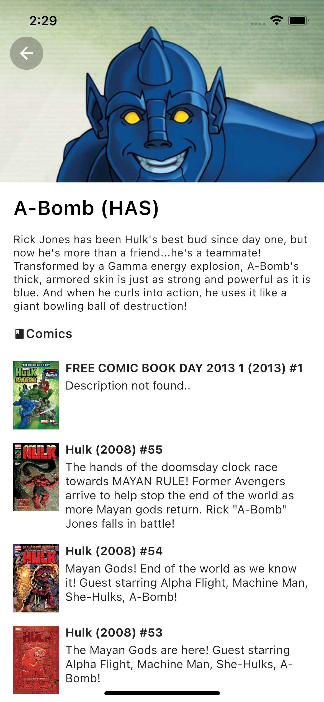
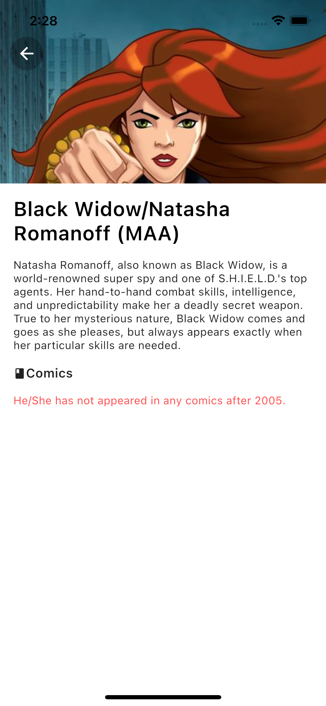

# Marvel API 🌱
host ->> https://developer.marvel.com


## For Android
First one :
```sh
flutter pub get
```

and then :
```sh
flutter pub run build_runner build --delete-conflicting-outputs
```

## For IOS

First one :
```sh
flutter pub get
```

and then :
```sh
cd ios
```

and then :
```sh
pod install
```
and then :
```sh
flutter pub run build_runner build --delete-conflicting-outputs
```

## App Screens




